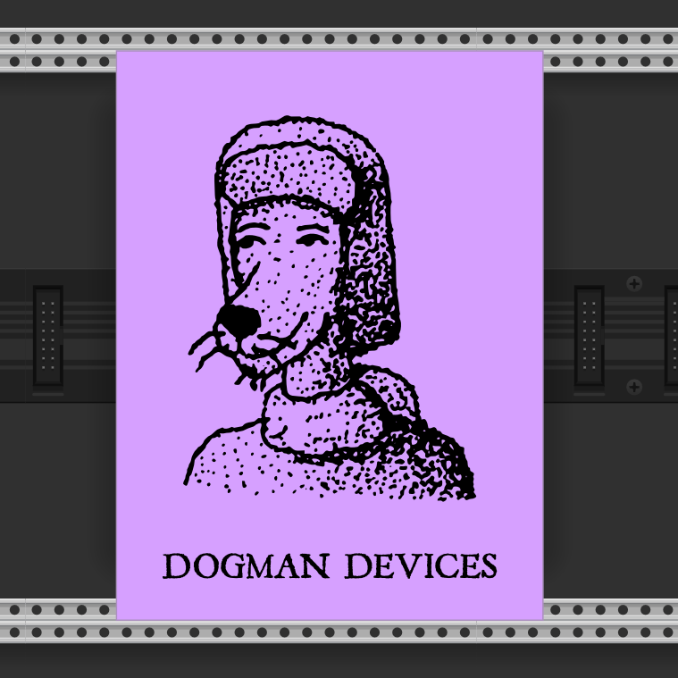
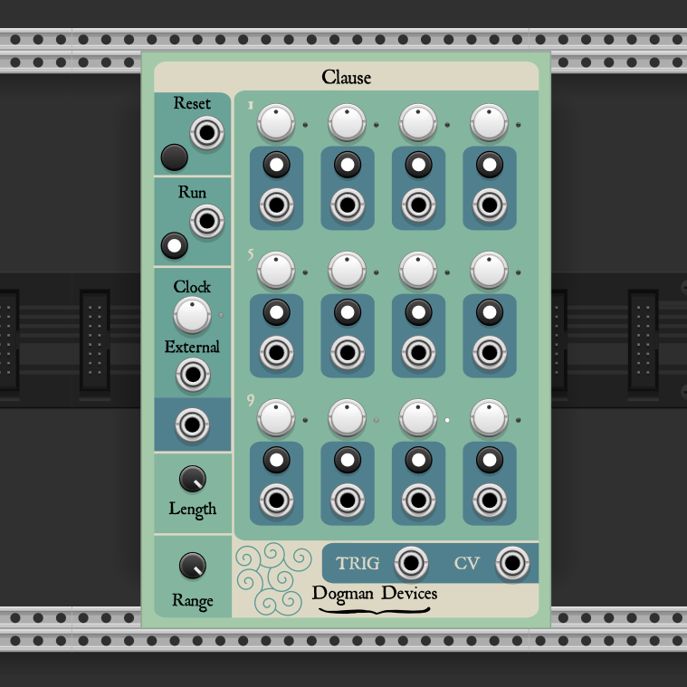
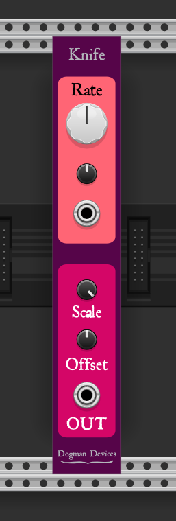
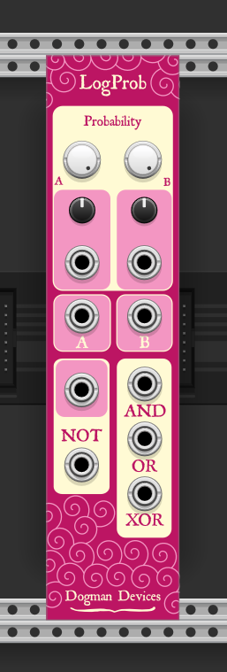
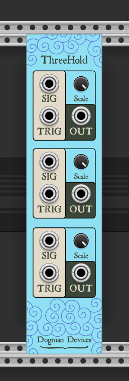
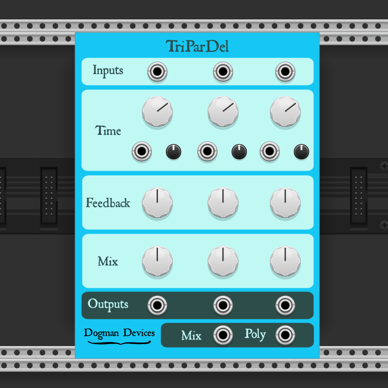
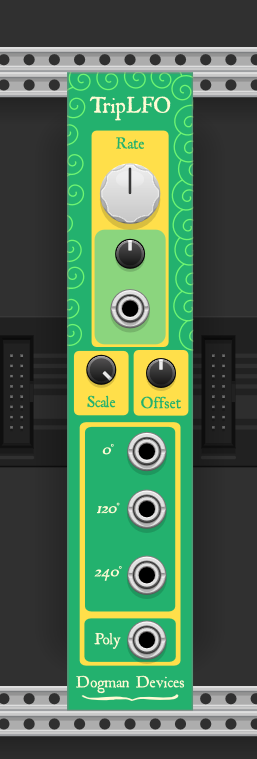

# Dogman Devices

Modules for [VCV Rack](https://github.com/VCVRack/Rack)

  - [Blank](#blank)
  - [Clause](#clause)
  - [Knife](#knife)
  - [LogProb](#logprob)
  - [ThreeHold](#threehold)
  - [TriParDel](#tripardel)
  - [TripLFO](#triplfo)
  - [Water](#water)

  ###  Blank
Jazz up your rack.

  ###  Clause
Clause is a twelve-step, polyphonic sequencer. There is an internal clock which can be overridden with CV. Adjustable sequence length. Output voltage scaling (default is -10 ~ 10 V). In addition to the trigger and voltage outputs, each step also can be toggled off/on and has it's own trigger output.

  ###  Knife
Knife is polyphonic noise source and triangulary-sawy LFO/Dirty Oscillator. Can be used as a somewhat predictable LFO, but also works with V/Oct for a dirty oscillator. Cleans up nicely with a filter. Can also be used as a noise source which varies in volume at low speeds, or as a general-purpose noise source at mid-speeds.

  ###  LogProb
Logical Probability provides standard logical operations, but each input has an adjustable probability for when the connected gate will be accepted as input. With the probability controls at their maximum, this behaves like a normal logic module. Great for creating variable rhythmic gates.

  ###  ThreeHold
ThreeHold is a stack of three polyphonic sample and hold units. The output voltage is by default -10~10 V, but the scale knob allows you to adjust it.

  ###  TriParDel
Triple Parallel Delay offers three independant delays. Each delay has CV adjustable time controls (along with an attenuverter). There is no normalization between delays. Each delay has its own output, and there is also a mono-mixed output as well as a three-channel polyphonic output. Can be patched as parallel delays for the same or different signals, and can also be patched into a single delay with three taps.

  ###  TripLFO
Triple LFO provides three equally phase-shifted sine wave LFOs. Each LFO has its own output as well as a three-channel polyphonic output. By default, the waves as equally phase-shifted, but a polyphonic CV source to the Rate control will make them all independent (unless the CV source is also equally phased-shifted).

  ###  Water
Water is a new interpretation of the [Water guitar pedal](https://www.dogmandevices.com/shop/water-chorus-tremolo). It is a chorus and tremolo which internally use different LFOs but their rates are controlled by the same knob. Chorus depth and tremolo depth can be adjusted to taste. All parameters accept CV input and each has an attenuator.
The primary differences between this and guitar pedal:
    - The pedal's chorus only utilizes a single sine LFO, this one uses three phase shifted sine waves
    - The pedal's tremolo LFO is more of a trapezoid wave, while this one is a triangle wave
    - The LFO rates and ranges are different in comparison to the pedal