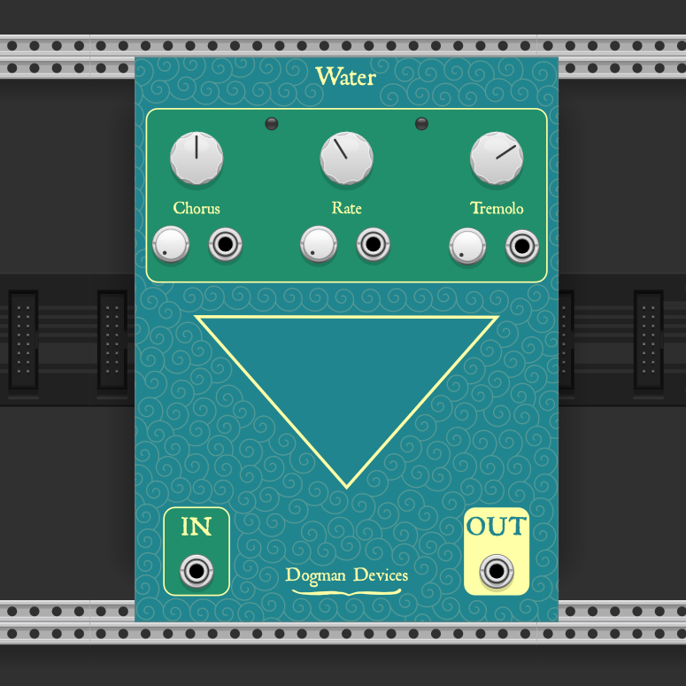

# Dogman Devices

Modules for [VCV Rack](https://github.com/VCVRack/Rack)

  - [Water](#water)

  ###  Water
Water is a new interpretation of the [Water guitar pedal](https://www.dogmandevices.com/shop/water-chorus-tremolo). It is a chorus and tremolo which internally use different LFOs but their rates are controlled by the same knob. Chorus depth and tremolo depth can be adjusted to taste. All parameters accept CV input and each has an attenuator.
The primary differences between this and guitar pedal:
    - The pedal's chorus only utilizes a single sine LFO, this one uses three phase shifted sine waves
    - The pedal's tremolo LFO is more of a trapezoid wave, while this one is a triangle wave
    - The LFO rates and ranges are different in comparison to the pedal